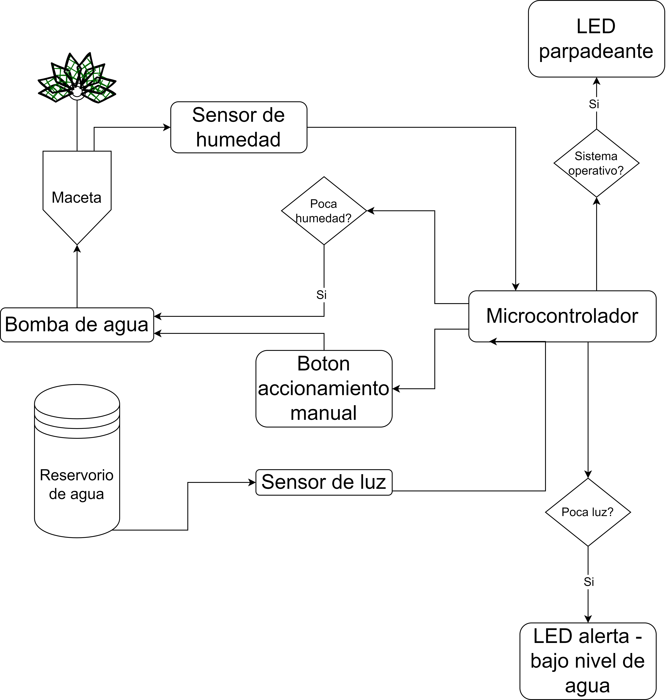

# Regador de plantas automático

Nombre: Nicolás Tertusio.

Correo: nicotertu@gmail.com

El objetivo de este programa consiste en regar automaticamente plantas empleando sensores de humedad. El programa obedece, a grandes rasgos, el siguiente diagrama de bloques:

El sistema cuenta con dos sensores: uno de humedad y uno de luz.

 - El sensor de humedad se instala dentro de la maceta y permite saber que tan seca está la tierra.
 - El sensor de luz se instala dentro del reservorio, en la parte inferior del mismo.
   - El reservorio tiene un pequeño tubo con una masa flotante que sube y baja dependiendo del nivel del agua.
   - Cuando el reservorio tiene poca agua, la masa flotante está a nivel del sensor de luz, bloqueando la luz e indicando la falta de agua.

El sistema cuenta tambien con dos luces LED indicadoras:

  - Una luz se enciende y apaga cada segundo indicando que el sistema está operativo y en modo automatico.
  - Una luz se enciende cuando el reservorio tiene poca agua.

